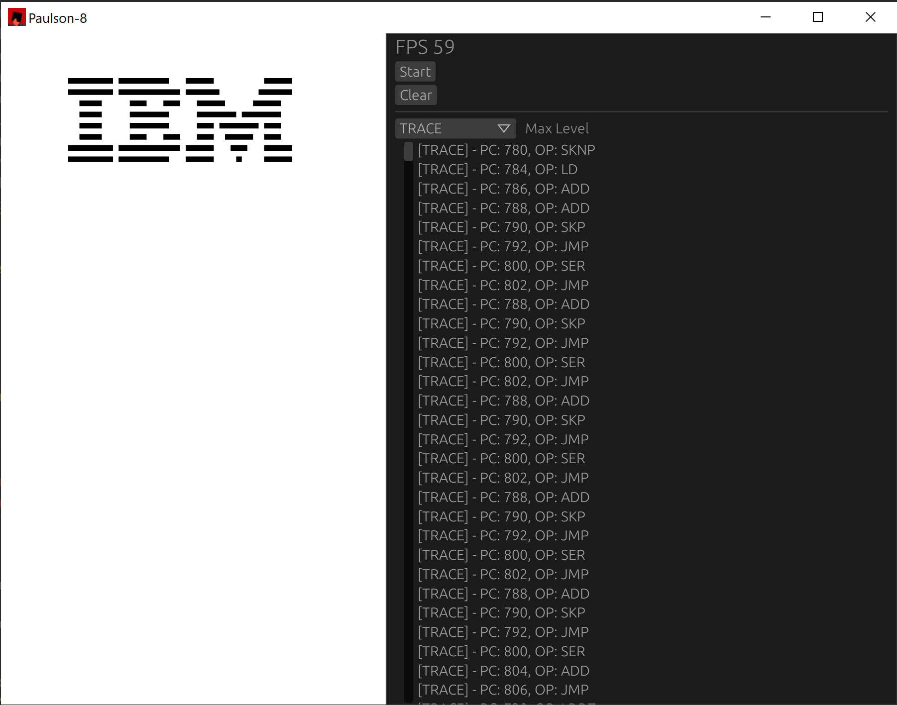

# Paulson-8



## About
Paulson-8 is a chip-8 interpreter written in Rust.

I hacked it together over a few days following Tobias V. Langhoff's guide. So it only runs and executes instructions correctly, everything else is hardcoded, i.e ROM loading. I mostly just see how an interpreter worked by writing one 'myself'.

## Dependencies
```
# ubuntu system dependencies
apt install pkg-config libx11-dev libxi-dev libgl1-mesa-dev libasound2-dev

# fedora system dependencies
dnf install libX11-devel libXi-devel mesa-libGL-devel alsa-lib-devel

# arch linux system dependencies
pacman -S pkg-config libx11 libxi mesa-libgl alsa-lib
```

## Credits
Tobias V. Langhoff - [Guide to making a CHIP-8 emulator](https://tobiasvl.github.io/blog/write-a-chip-8-emulator/)  
Timendus - [Chip-8 Test Suite](https://github.com/Timendus/chip8-test-suite)
